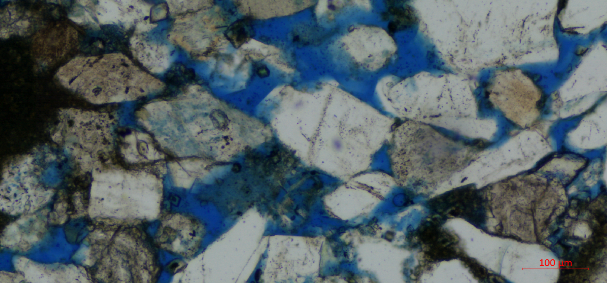
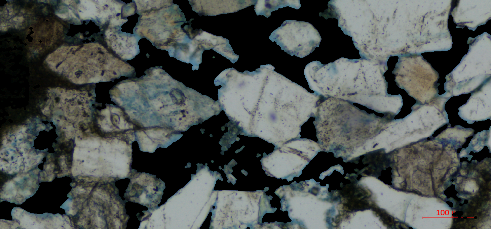
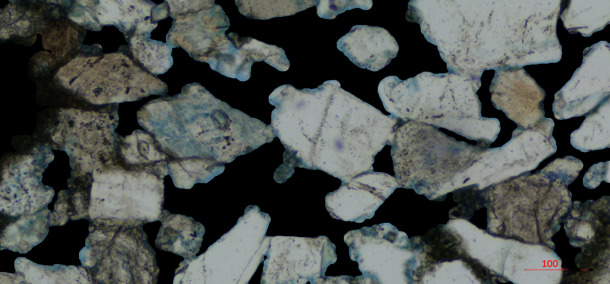
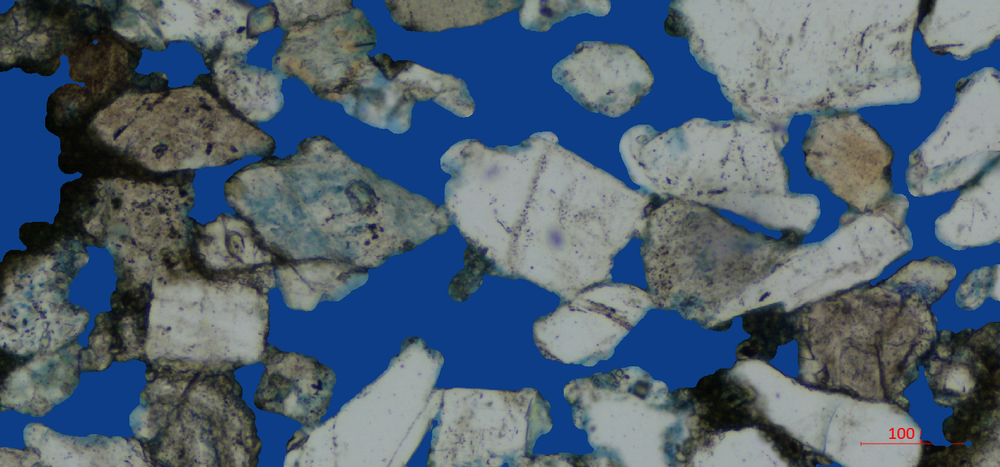

# About Pore throat and Image Relate Experiment

- relate image show
## src image

  
  

## pore extracted image

  
  

## small particle or noise removed 

  
  

## color cleaned 

  
  

# preprocess step
##    1. ectract pore 
##    2. remove small object or noise
##    3. median filter
##    4. exchange black and white, cv.subtract(255, img) 
##    5. color replace

                                
                                